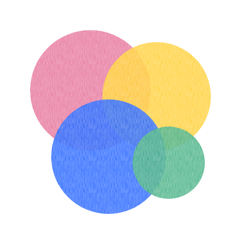
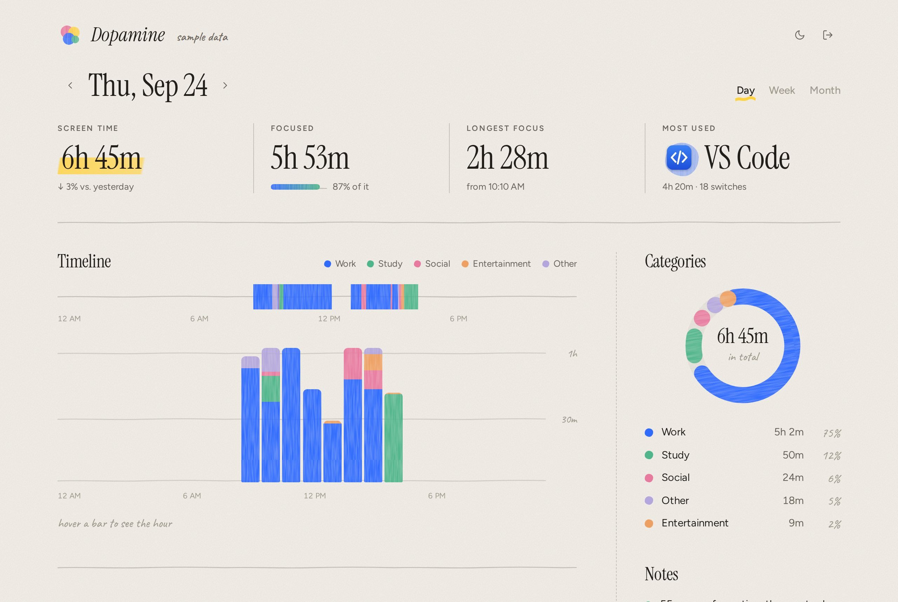

<p align="center">
  
</p>

<h1 align="center">Dopamine</h1>

<p align="center">什么都不用做，就能看清时间都去哪了。</p>

<p align="center">
  <a href="README.md" lang="en">English</a> | <strong>简体中文</strong>
</p>

<p align="center">
  <a href="https://github.com/TempestShaw/Dopamine/releases/latest">下载</a> ·
  <a href="#开始记录">快速开始</a> ·
  <a href="#隐私">隐私</a> ·
  <a href="#架构">架构</a>
</p>

<p align="center">
  <a href="https://github.com/TempestShaw/Dopamine/actions/workflows/build.yml"></a>
  
  
  <a href="LICENSE"></a>
</p>

Dopamine 是一个适用于 macOS 和 Windows 的轻量屏幕时间记录工具。它记下每一刻在最前面的是哪个 App、哪个窗口，数据只存在你自己的电脑上，再把一天画成时间轴、按 App 和窗口的明细，以及一整月的颜料点日历。锁屏、睡眠或离开电脑时，它会自动暂停。

<p align="center">
  <picture>
    <source media="(prefers-color-scheme: dark)" srcset="assets/dashboard-dark.png">
    
  </picture>
</p>

## 开始记录

从 [Releases](https://github.com/TempestShaw/Dopamine/releases/latest) 下载适合你电脑的最新版本。

**macOS 12 或更高版本**

1. 解压 `Dopamine-mac.zip`，把 `Dopamine.app` 拖进"应用程序"。
2. 打开它。这个早期版本还没有经过 Apple 公证，第一次打开时 macOS 会拦一下：到"系统设置 → 隐私与安全性"里点 **仍要打开**。
3. 系统询问时允许 **辅助功能** 权限，这样 Dopamine 才能读取窗口标题。不允许的话只会记录 App 名称。
4. 点击菜单栏里的沙漏图标，再点 **Open Dashboard**。

**Windows 10 或更高版本**

1. 把 `Dopamine-win.zip` 解压到任意位置，运行 `DopamineWin.exe`。不需要安装 .NET。
2. 右键托盘图标（或者直接双击），选择 **Open Dashboard**。

仪表盘会在 [localhost:26535](http://localhost:26535) 打开，并自动完成配对。如果需要手动连接，菜单里显示的六位配对码可以用上。

## 为什么用 Dopamine？

- **零操作。** 不用开始、停止或打标签。锁屏、睡眠或五分钟没碰键盘鼠标时，时间自动停止计算。
- **数字诚实。** 在前台停留不到五秒的窗口不算；程序意外退出也不会把一天的时间撑大；今天和昨天比较时，只比到同一时刻。
- **看得到细节。** 时间轴精确显示每个窗口在什么时候处于前台。点开任意 App，可以看到它里面的窗口和标签页，还有 App 的真实图标。
- **分类贴合你。** 工作、学习、社交、娱乐、其他会自动识别；点一下就能永久改掉某个 App 的分类。
- **只算你想算的。** 任何 App 都可以从统计里隐藏；Dopamine 自己的窗口默认不计入。
- **说你的语言。** 仪表盘和菜单栏、托盘都支持 English、简体中文和繁體中文。
- **不占资源。** 原生的菜单栏或托盘程序、一个本地 SQLite 文件，仪表盘不依赖任何图表库，稳定 60 帧。

## 你会看到什么

| | |
| --- | --- |
| 时间轴 | 24 小时里每个窗口的色带，以及按小时或按天的堆叠柱状图 |
| App 与窗口 | 每个 App 的时长和图标，展开能看到里面的窗口和标签页 |
| 会话 | 在每个 App 里连续使用的记录 |
| 分类 | 时间分布的环形图，以及修改任意 App 分类的选择器 |
| 笔记 | 最长专注时段、状态最好的时段、最大的干扰源、切换频率 |
| 日历 | 用颜料点画出整个月，从最轻松的一天到最忙的一天 |
| 菜单栏 / 托盘 | 一眼看到今天的总时长和最常用的 App |

## 分类是怎么判断的

内置规则只管用途明确的 App 和网站。其余的交给一个很小的标题模型来读；你的每次纠正都会在你自己的电脑上训练它，就像邮箱学习你标记的垃圾邮件。

Dopamine 按下面的顺序查找依据，找到答案就停：

| 依据 | 例子 |
| --- | --- |
| 你手动分类过的窗口 | 你把 "Stack Overflow" 标成了学习 |
| 你的标题规则 | 标题包含 "CS 101" 的窗口算学习 |
| 你自己为这个 App 选的分类 | 你把 Discord 设成了学习，它就算学习 |
| 浏览器看网站 | `Two Sum - LeetCode - Google Chrome` → 学习 |
| 按 App 名称 | `idea64`、`LeagueClientUx`、`WXWork` |
| 其他用户的共识 | 仅在你选择加入时使用，并且只用于规则不认识的 App |
| App 对自己的描述 | macOS 的 App Store 类别；Windows 的发行商和安装路径（装在 `steamapps` 里就是游戏） |
| 标题模型 | `Week 6 lecture: dynamic programming` → 学习，`季度工作汇报` → 工作 |

笔记 App 和 AI 聊天（Notion、Obsidian、ChatGPT……）什么用途都有，所以直接交给标题模型判断。在视频网站上，模型有八成以上把握时，会把课程视频算作学习。

标题模型是基于单词和中文双字的朴素贝叶斯：不用下载，训练只要几毫秒。它从一组中性的示例标题起步，并从你分类的每个窗口、设定的每条规则里学习，这些都不会离开你的电脑。

规则和示例标题放在 [`category-rules.json`](DopamineWeb/src/lib/category-rules.json) 里，仪表盘和 macOS 程序共用。它们用真实的进程名和网页标题测试过，另外还有从未用来调整的独立测试集。

## 隐私

你的使用记录永远不会离开你的电脑。窗口标题、时间和用量都存在本地 SQLite 数据库里，只通过 `localhost` 提供，并且需要配对码。

唯一的例外是可选的。你第一次为某个 App 选择分类时，仪表盘会询问是否分享这个选择，好让其他人也受益。如果你同意，这就是它发送的全部内容（这一次和以后的选择都一样）：

```json
{ "p_install": "<本次安装的随机 ID>", "p_app": "Discord", "p_platform": "mac", "p_category": "study" }
```

请求由 [`community.ts`](DopamineWeb/src/lib/community.ts) 生成，由 [`supabase/migrations`](supabase/migrations) 里的函数保存。浏览器的选择永远不会发送。一个 App 要有至少 5 个安装、70% 以上意见一致，才会得到社区分类。你可以随时在仪表盘页脚关闭分享。本版本还没有开启分享：服务器尚未配置，因此不会发送任何内容。

## 架构

```text
 macOS 菜单栏程序（Swift）             Windows 托盘程序（C# / .NET 8）
   NSWorkspace + 辅助功能                 GetForegroundWindow + GetLastInputInfo
                  \                          /
                   SQLite：WindowActivities、AppInfo
                                 ↓
                 本地接口 localhost:26535
       /identify · /pair · /titles · /apps · /settings
                                 ↓
          仪表盘（Next.js 静态导出，由程序自己提供）
```

每个程序在前台窗口变化时写一行记录，停止记录或进入空闲时再写一行标记。仪表盘把这些记录换算成时长。所有受保护的请求都带 `Authorization: Bearer <配对码>`。

| 目录 | 内容 |
| --- | --- |
| [`DopamineMac`](DopamineMac) | Swift 菜单栏程序，没有第三方依赖 |
| [`DopamineWin`](DopamineWin) | C# 托盘程序 |
| [`DopamineWeb`](DopamineWeb) | 仪表盘，导出成静态文件后打包进两个程序 |
| [`supabase`](supabase) | 可选的社区分类的服务器端 |

## 从源码构建

先构建仪表盘，两个程序都会把它打包进去。

```bash
cd DopamineWeb
bun install
bun run build
```

**macOS**（Xcode 15 或更高版本）：

```bash
cd DopamineMac
swift run                 # 直接从源码运行
./scripts/bundle.sh       # 在 dist/ 里生成通用版 Dopamine.app
```

**Windows**（.NET 8 SDK）：

```powershell
cd DopamineWin
dotnet run
```

**只开发仪表盘**，使用示例数据或正在运行的程序：

```bash
cd DopamineWeb
bun dev                   # http://localhost:3000
bun run preview           # 生成一个使用示例数据的独立 HTML 文件
```

修改 `category-rules.json` 之后，运行 `bun run sync-rules`，让 macOS 程序使用同一套规则。

## 测试

```bash
cd DopamineWeb && bun test src      # 时长计算、分类、社区分享内容
cd DopamineMac && swift test        # 数据库、接口、分类
```

每次推送，CI 都会构建并测试三个部分；打版本标签时会把 `Dopamine-mac.zip` 和 `Dopamine-win.zip` 附到 release 上。

## 可靠性与许可证

这是一个早期版本。自动化测试覆盖了构建、存储、接口和分类；在真实电脑上的行为（权限弹窗、锁屏和睡眠处理、菜单栏和托盘）靠人工检查，所以遇到任何异常，欢迎[提交问题](https://github.com/TempestShaw/Dopamine/issues/new)，并附上你的系统版本和看到的现象。

分类只是估计，判断错了请在仪表盘里改正。

[MIT](LICENSE)。
