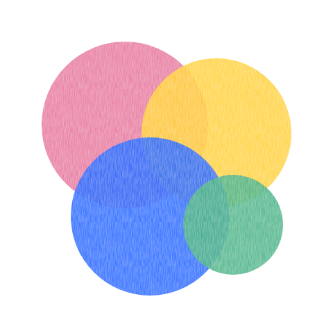
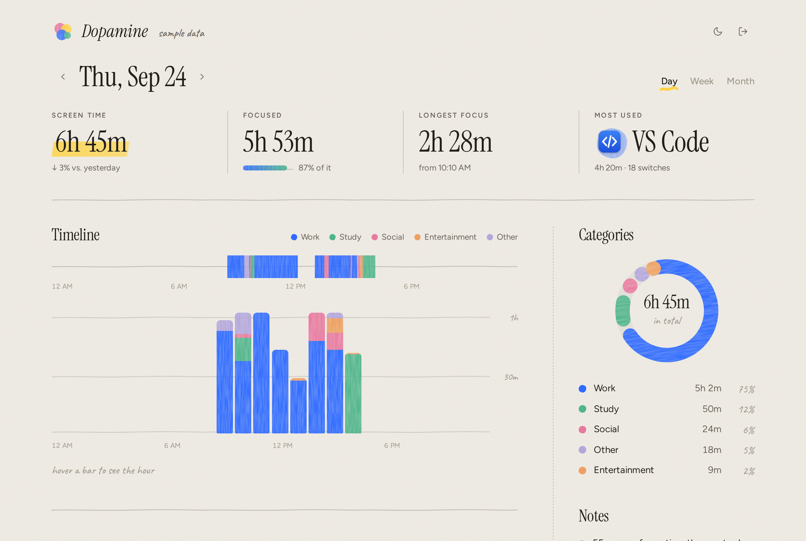

<p align="center">
  
</p>

<h1 align="center">Dopamine</h1>

<p align="center">什么都不用做，就能看清时间都去哪了。</p>

<p align="center">
  <a href="README.md" lang="en">English</a> | <strong>简体中文</strong>
</p>

<p align="center">
  <a href="https://tempestshaw.github.io/Dopamine/?lang=zh-CN">网站</a> ·
  <a href="https://github.com/TempestShaw/Dopamine/releases/latest">下载</a> ·
  <a href="#开始记录">快速开始</a> ·
  <a href="#隐私">隐私</a> ·
  <a href="#架构">架构</a>
</p>

<p align="center">
  <a href="https://github.com/TempestShaw/Dopamine/actions/workflows/build.yml"></a>
  
  
  <a href="LICENSE"></a>
</p>

Dopamine 是一个适用于 macOS 和 Windows 的轻量屏幕时间记录工具。它记下每一刻前台是哪个 App、哪个窗口，数据只存在你自己的电脑上；然后把一天画成时间轴，按 App 和窗口细分，并用颜料点日历呈现整个月的概貌。锁屏、睡眠或离开电脑时，它会自动暂停。

<p align="center">
  <picture>
    <source media="(prefers-color-scheme: dark)" srcset="assets/dashboard-dark.png">
    
  </picture>
</p>

<p align="center"><a href="https://tempestshaw.github.io/Dopamine/?lang=zh-CN#film">▶ 看 48 秒的介绍动画</a>，了解 Dopamine 怎么记录一天。</p>

## 开始记录

从 [Releases](https://github.com/TempestShaw/Dopamine/releases/latest) 下载适合你电脑的最新版本。

**macOS 12 或更高版本**

1. 打开 `Dopamine-mac.dmg`，把 `Dopamine` 拖进「应用程序」。
2. 打开它。这个早期版本还没有经过 Apple 公证，第一次打开时 macOS 会拦一下：到「系统设置 → 隐私与安全性」里点 **仍要打开**。
3. 系统询问时允许 **辅助功能** 权限，这样 Dopamine 才能读取窗口标题。不允许的话只会记录 App 名称。
4. 点击菜单栏里的沙漏图标，再点 **Open Dashboard**。勾选那里的 **登录时打开**，开机后就会自动运行。

**Windows 10 或更高版本**

1. 把 `Dopamine-win.zip` 解压到任意位置，运行里面的 `DopamineWin.exe`；也可以运行 release 中的 `Dopamine-win-Setup.exe` 安装。不需要安装 .NET。
2. 单击托盘图标打开仪表盘，右键可以打开菜单。再次运行 `DopamineWin.exe` 也会打开仪表盘。在同一个菜单里选 **开机时启动**，登录 Windows 后就会自动运行。

## 为什么用 Dopamine？

- **零操作。** 不用开始、停止或打标签。锁屏、睡眠或五分钟没有键鼠输入时，时间自动停止计算。
- **数字诚实。** 在前台停留不到五秒的窗口不算；程序意外退出也不会把一天的时间撑大；今天和昨天比较时，只比到同一时刻。
- **看得到细节。** 时间轴精确显示每个窗口在什么时候处于前台。点开任意 App，可以看到它里面的窗口和标签页，还有 App 的真实图标。
- **分类贴合你的习惯。** 工作、学习、社交、娱乐、其他会自动识别。点一个窗口就能设置它的分类：只针对这个标题，或者针对标题里包含某些字（课程编号、频道名）的所有窗口；可以适用于所有浏览器，也可以只限某个 App。也能一键改掉整个 App 的分类。
- **只算你想算的。** 任何 App 都可以从统计里隐藏；Dopamine 自己的窗口默认不计入。
- **不想留的就删掉。** 在仪表盘里可以删除某个窗口或某个时段：标题会从磁盘上抹掉，时间也不再计入。如果干脆不想被记录，可以在菜单栏或托盘里暂停 15 分钟、1 小时、到明天，或直到你手动继续。
- **有新版本会自动更新。** 程序每天检查新版本，在后台下载并在退出时安装；也可以在菜单栏、托盘或仪表盘里点击 **更新并重启**，不用手动下载或替换文件。
- **今天一目了然的侧边栏。** 当前在前台的应用和已持续的时间、今日目标（屏幕时间上限和专注目标，附进度），以及 25 或 50 分钟的专注计时器，结束时会响铃提示。即使你在看别的日期，它也始终显示今天。
- **跳到任意一天。** 点击顶部的日期或日历中的任意一天即可跳转。可以往前翻看更早的月份，每一天按屏幕使用时长上色。
- **说你的语言。** 仪表盘和菜单栏、托盘都支持 English、简体中文和繁體中文。
- **不占资源。** 原生的菜单栏或托盘程序、一个本地 SQLite 文件，仪表盘不依赖任何图表库，流畅运行在 60 帧。

## 你会看到什么

|  |  |
| --- | --- |
| 时间轴 | 24 小时里每个窗口的色带，以及按小时或按天的堆叠柱状图 |
| App 与窗口 | 每个 App 的时长和图标，展开能看到里面的窗口和标签页 |
| 会话 | 各 App 的连续使用记录 |
| 分类 | 时间分布的环形图，以及修改任意 App 分类的选择器 |
| 洞察 | 最长专注时段、状态最好的时段、最大的干扰源、切换频率 |
| 日历 | 用颜料点画出整个月，从最轻松的一天到最忙的一天 |
| 菜单栏 / 托盘 | 一眼看到今天的总时长和最常用的 App |

## 分类是怎么判断的

Dopamine 按下面的顺序查找依据，找到答案就停：

| 依据 | 例子 |
| --- | --- |
| 你自己为这个 App 选的分类 | 你把 Discord 设成了学习，它就算学习 |
| 浏览器窗口中的网站 | `Two Sum - LeetCode - Google Chrome` → 学习 |
| 按 App 名称 | `idea64`、`LeagueClientUx`、`WXWork` |
| App 对自己的描述 | macOS 的 App Store 类别；Windows 的发行商和安装路径（装在 `steamapps` 里就是游戏） |
| 窗口标题 | `javaw` 显示 "Minecraft" |

规则放在 [`category-rules.json`](DopamineWeb/src/lib/category-rules.json) 里，仪表盘和 macOS 程序共用。规则经过 115 个真实进程名和网页标题的测试，另外还有一组从未用来调整规则的独立测试集。

## 隐私

你的使用记录永远不会离开你的电脑。窗口标题、时间和用量都存在本地 SQLite 数据库里，只通过 `localhost` 提供，并且需要配对码。

macOS 使用 Sparkle，Windows 使用 Velopack，从 GitHub Releases 获取更新。这些请求不会上传使用记录、窗口标题或本地分类选择。可以在仪表盘底部关闭后续自动检查和下载；Sparkle 已经准备好的更新仍可能在退出时安装。详见[更新配置与测试](docs/updates.md)。

## 架构

```text
 macOS 菜单栏程序（Swift）             Windows 托盘程序（C# / .NET 8）
   NSWorkspace + 辅助功能                 GetForegroundWindow + GetLastInputInfo
                  \                          /
                   SQLite：WindowActivities、AppInfo
                                 ↓
                 本地接口 localhost:26535
       /identify · /pair · /titles · /apps · /settings
                                 ↓
          仪表盘（Next.js 静态导出，由程序自己提供）
            在程序自己的窗口中：Windows 用 WebView2，macOS 用 WKWebView
```

每个程序在前台窗口变化时写一行记录，停止记录或进入空闲时再写一行标记。仪表盘把这些记录换算成时长。所有受保护的请求都带 `Authorization: Bearer <配对码>`。

| 目录 | 内容 |
| --- | --- |
| [`DopamineMac`](DopamineMac) | Swift 菜单栏程序，没有第三方依赖 |
| [`DopamineWin`](DopamineWin) | C# 托盘程序 |
| [`DopamineWeb`](DopamineWeb) | 仪表盘，导出成静态文件后打包进两个程序 |

## 从源码构建

先构建仪表盘，两个程序都会把它打包进去。

```bash
cd DopamineWeb
bun install
bun run build
```

**macOS**（Xcode 15 或更高版本）：

```bash
cd DopamineMac
swift run                 # 直接从源码运行
DOPAMINE_DASHBOARD_URL=http://localhost:3000/ DOPAMINE_OPEN_DASHBOARD=1 swift run   # 仪表盘窗口指向 `bun dev`
./scripts/bundle.sh       # 在 dist/ 里生成通用版 Dopamine.app
```

**Windows**（.NET 8 SDK）：

```powershell
cd DopamineWin
dotnet run
```

**只开发仪表盘**，使用示例数据或正在运行的程序：

```bash
cd DopamineWeb
bun dev                   # http://localhost:3000
bun run preview           # 生成一个使用示例数据的独立 HTML 文件
```

修改 `category-rules.json` 之后，运行 `bun run sync-rules`，让 macOS 程序使用同一套规则。

## 测试

```bash
cd DopamineWeb && bun test src      # 时长计算、分类
cd DopamineMac && swift test        # 数据库、接口、分类
```

每次推送，CI 都会构建并测试三个部分；打版本标签时会把 `Dopamine-mac.dmg`、`Dopamine-mac.zip` 和 `Dopamine-win.zip` 附到 release 上。

## 可靠性与许可证

这是一个早期版本。自动化测试覆盖了构建、存储、接口和分类；在真实电脑上的行为（权限弹窗、锁屏和睡眠处理、菜单栏和托盘）靠人工检查，所以遇到任何异常，欢迎[提交问题](https://github.com/TempestShaw/Dopamine/issues/new)，并附上你的系统版本和看到的现象。

分类只是估计，判断错了请在仪表盘里改正。

[MIT](LICENSE)。
